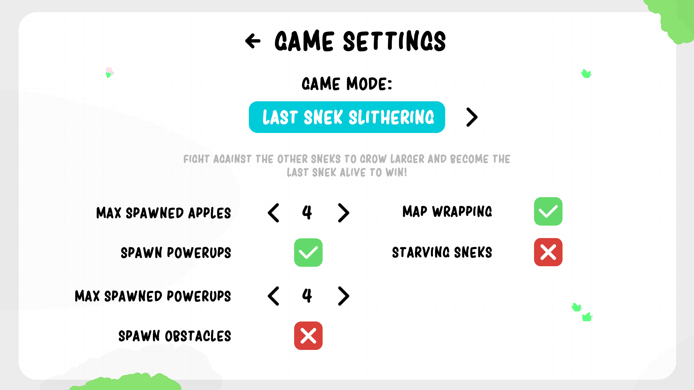

 

   

 

<h2>🗒️ Project Description</h2>

 
Several Snek! is a remake of the classic Snake games that I did as a fun project! Along with your snake, called a snek in this game, all of the classic rules apply! You can't hit yourself or you die! Eating apples will increase the length of your snek by one!  Along with these and depending on how you want to play, you can also enable/disable classic features such as map wrapping (where you go off one side of the map and appear on the opposite side) for a more or less challenging experience!

  Along with the classic snake experience, more fun features have been added!

  This project was created to familiarize myself with a multiplayer-focused game development architecture within the Unity game engine.
Some aspects of this project include:
  - Utilization of Unity's Lobby system and multiplayer services to allow games to be hosted and joined without the need to port forward.
  - Client Authoritative networking
  - Custom data handling and snycronization for the player characters over the network
  - Networked player customization (color)
  - Proper network error handling (i.e. host disconnect)
  - Utilizing multiple scenes within a networked game

There are some additional elements that were a part of this project, such as basic map generation, powerups, and different game-modes, but the multiplayer networking was the primary focus.

 

<h2>⬇️ Completed Project Download</h2>
This project is fully playable and available on my itch.io page!  
It can be viewed and downloaded here: https://coba-platinum.itch.io/severalsnek

  

*Coba Platinum is an alias that I have used since highscool when releasing anything to the public!

 

<h2>📦 Project Repository</h2>
This project is fully available in this repository!

 

  
  

  
  

 

<h2>🛠️ Tools Used</h2>

 

 [Unity] - Primary Game Engine

 [Blender] - 3D Modelling

 [Git] - Source Control

 

 

  
  

  
  

  
  

  

 

<h2>🧠 Project Reflection</h2>

- **How would you describe the process of creating and polishing the artifact?**
  
I feel that creating and polishing this artifact was very enjoyable and challenging, as I had to learn a completely different game architecture to create a fun and engaging multiplayer experience. I started with a basic idea of what I wanted to do, which was a multiplayer version of the classic snake game, and began from there. I first created a singleplayer prototype of the game, allowing my to plan and develop the different game mechanics for the game, followed by implementing working multiplayer into the game. Though this is not the recommended method of creating a multiplayer game, as it takes a lot more work, it did allow me to get a full understanding of the differences between crafting a singleplayer and multiplayer experience from behind the scenes.
  
- **What did you learn as you were creating it and improving it?**

This project gave me a chance to learn the many systems and techniques that make a multiplayer game possible. I was able to gain knowledge with with different game-related multiplayer architectures, such as peer-to-peer, client-server, etc. and when their strengths and weaknesses for different play styles within a game. I was able to learn how clients communicate with the server, and vice versa, in order to sync the game state for all players, whether that be player locations, enemy locations, animations, player statistics, and more. Whilw working on this project, I had to completely rethink about how game logic clasically works within a singleplayer experience, as a lot of different implementations for one more than likely will not work for the other. I also gained experience with Unity's multiplayer tools, specifically netcode for game objects and their lobby system, in order to complete this project.

- **What challenges did you face?**

Honestly, I feel that there were not really any challenges within this project, as it was heavily focused on just trying things out and having fun with it. Some things needed to be redesigned, as I did not like how they fit with the rest of the environment, but that was about as challenging as it got.

- **How could this artifact be improved?**

The artifact originally contained a terrain with materials applied and the UFOs placed around the map as cones. This artifact was improved by introducing fully materialled custom models to almost every aspect of the terrain and the objects placed around the terrain. Along with this, grass was added to the terrain that is dynamically placed based on the material used at that position on the terrain.

 

 

  

